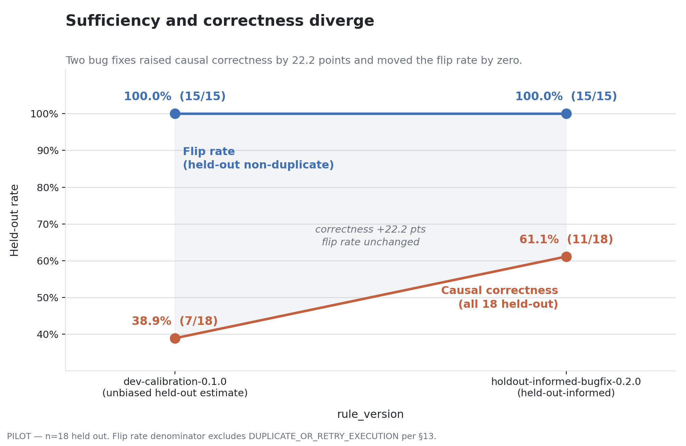

# FAISLA

**F**ault **A**ttribution **I**n **S**ystems of **L**LM **A**gency — a pilot benchmark for
whether AI-mediated payment disputes can be adjudicated from evidence.

---

Conventional payment-dispute evidence resolves **0% (0/15)** of held-out
non-duplicate agent-payment disputes; agent-aware evidence resolves **100%
(15/15)**. Read carefully, **neither of those numbers is the finding** — both
follow largely from how the two conditions are constructed. The finding is
what happens to *correctness*: of the disputes it resolves, the adjudicator
attributes fault correctly only **38.9%** of the time under the frozen rule
set, rising to **61.1%** after two disclosed bug fixes. **Evidence sufficiency
and evidence correctness are different measurements, and an instrument
reporting only the first would score this run a complete success.**



The two bug fixes moved causal correctness by 22.2 points and moved the flip
rate by exactly zero. A benchmark scoring sufficiency alone could not tell the
two rule sets apart.

### What this pilot establishes

One thing, and it does not depend on the adjudicator being any good: **two rule
sets 22.2 correctness points apart both scored 100% on evidence sufficiency.**
That is a paired comparison — same corpus, same evidence, one rule set frozen
before the held-out run and one fixed after it — and the sufficiency metric
could not tell them apart, so a benchmark reporting sufficiency alone would
have certified both runs a complete success: the one wrong 11 times out of 18
and the one wrong 7. It establishes nothing about whether the adjudicator is
good — the section below publishes a four-line baseline that beats it outright
— and nothing about whether this corpus can rank methods, which it cannot,
because its evidence flags were authored in the same pass as its labels. What
survives is the separation itself: sufficiency and correctness are different
measurements, and on this run only one of them was moving.

### Why the 0% and the 100% are not the finding

**The 0% is deductive, not experimental.** It follows from the anchor's field
list: the card-network dispute record enumerated in
[E0_ANCHOR.md](E0_ANCHOR.md) contains no field expressing delegated authority,
so no fault-attribution signal exists to read. The adjudicator encodes this
directly — `_causal_e0()` returns "undetermined" unconditionally. Given the
anchor, 0% is a **structural fact about the conventional schema**, established
by reading the spec, not discovered by running an experiment. The experiment
confirms the implementation matches the anchor; it does not independently
establish the claim.

**The 100% is close to guaranteed by construction.** E3's causal ladder is
*total* — every in-scope scenario is absorbed as `NO_VIOLATION`, every scenario
carrying a merchant- or system-side signal is absorbed by the rule matching it,
and a residual catch-all takes whatever remains by elimination. Only the
duplicate rule declines to answer. **17 of 18 held-out scenarios receive a
determinate cause, with 1 abstention.** A 100% flip rate therefore measures
"an answer became derivable", not "the evidence was good". The kill-test report classifies this run's flip metric as
[**degenerate**](results/kill_test_report.md) for exactly this reason: every
non-duplicate flip traces to a single rule firing identically, with near-zero
variance.

**Correctness is the number that carries information.** Errors are
bottlenecked upstream, at scope resolution — which is derived from mandate,
budget, category and merchant comparisons, not from any flag. Under v0.2.0,
**6 held-out scenarios are wrong on both scope and cause, 1 on cause alone,
and 0 on scope alone**: no causal judgment ever rescues a failed scope
judgment, and fixing scope is what moved correctness 22 points. The clause about flags
describes the rules, not the corpus — and on this corpus a trivial reader of
those fields outperforms the adjudicator outright; the full baseline comparison
follows below.

**But perfect scope resolution would not reach 100%, and the reason is
structural.** The causal ladder has **no `AMBIGUOUS_INTENT` branch at all** —
the string does not appear in `deterministic.py`, in `frozen_v0_1_0.py`, or in
`adjudication/schemas.py`. Three held-out scenarios carry `AMBIGUOUS_INTENT` as
ground truth (SC-AHI-002, SC-AHI-003, SC-AHI-004), so they are **unreachable by
construction**: no input can make either adjudicator emit the right answer.
**The causal ceiling is therefore 15/18 = 83.3%**, not 100%, before any rule is
written. The residual consequence is that ambiguous instructions fall through
`E3-C5-residual-agent-attribution` to `AGENT_ERROR` by elimination — the
adjudicator does not decline on ambiguity, it silently blames the agent.

### What a trivial baseline scores

An accuracy figure means nothing without the floor it stands on, so here is the
floor. `baselines.py` computes two baselines from committed artefacts:
a **flag-reader** that maps one E3 boolean to one causal category and falls back
to `AGENT_ERROR`, and a **constant** that always predicts `OUT_OF_SCOPE`.
Neither reads a mandate, an amount, or a rule.

| held-out (n=18) | causal | scope |
|---|---|---|
| flag-reader / always-`OUT_OF_SCOPE` | **17/18 — 94.4%** | **17/18 — 94.4%** |
| adjudicator v0.2.0 | 11/18 — 61.1% | 12/18 — 66.7% |
| margin | **−6** | **−5** |

**Both trivial baselines beat the adjudicator on the held-out split.** On dev
(n=6) the ordering reverses — flag-reader 3/6 against the adjudicator's 4/6,
constant-scope 5/6 against 6/6 — which is itself a warning about six-scenario
splits.

**This is a fact about the corpus, not a result about rule engines — and it is
two different defects, only one of which is leakage.**

**The flag-reader result is leakage.** The E3 booleans were authored in the
same pass as the labels sitting beside them, so they encode the answer almost
perfectly. The clearest case is `instruction_flagged_ambiguous`, named here for
the first time in this repository: it is `True` on **exactly the four
`AMBIGUOUS_HUMAN_INSTRUCTION` scenarios and `False` on all 20 others**, which
makes it a label in boolean clothing. It is **the same defect as the degenerate
flip metric, one level up** — a feature with no independent variance cannot
discriminate between methods, and neither can a benchmark built on it.

**The constant-scope result is not leakage at all — it is base rate.** That
baseline reads no field whatsoever, so it cannot be exploiting a boolean. It
scores 94.4% because **17 of the 18 held-out scenarios carry
`scope_violation: true`** — the sole exception is SC-SSI-004 — so a predictor
that always answers `OUT_OF_SCOPE` inherits the corpus's own class imbalance
for free. The consequence is harsher than the flag-reader's, not milder:
**the adjudicator's 12/18 sits below the majority-class floor**, so on this
split its scope rules demonstrate no information about scope at all. An earlier
version of this section attributed both baselines to the booleans; that
explanation is wrong for the constant, and the corrected one is less
flattering, not more.

Two consequences follow, and both are load-bearing:

1. **61.1% is a lower bound on a corpus that cannot currently discriminate
   methods.** It is not evidence that the rules are bad, and a higher number
   would not have been evidence that they are good. The LLM pilot below is the
   same lesson from the other direction: swapping a rule for a model moved
   nothing, because the corpus cannot resolve that comparison either.
2. **Repairing it is post-submission work, and it would invalidate every
   number here.** The fix is to delete the booleans and leave the raw artefacts
   — the injection payload, the cart delta, the inconsistent state — so that
   *detecting* misconduct becomes part of the task rather than a field lookup.
   Every figure in this README is computed against the corpus as it stands, and
   would have to be recomputed after such a change. It has deliberately not
   been done: rebuilding the corpus after seeing these results is the one edit
   that would make the numbers unpublishable.

This supersedes an earlier framing in this README, which reported that a naive
flag-reader scores 10/11 on the 11 held-out scenarios where a merchant- or
system-side flag is set. That figure is correct but was a **restricted**
baseline — it excluded the 7 scenarios with no such flag and omitted
`instruction_flagged_ambiguous` entirely, and it was presented without the
unrestricted baseline that would have shown the adjudicator losing.
Reproduce with `python baselines.py`; pinned by
[tests/test_baselines.py](tests/test_baselines.py).

---

## Start here

| | |
|---|---|
| **[Exhibit — SC-MPI-001](https://puni344.github.io/razor-pay/faisla_demo.html)** | The single clearest case, with an animated evidence reveal. A merchant embeds a fake `"SYSTEM INSTRUCTION"` in its catalog, the agent obeys, and 2499 is spent against an "under 500 rupees" instruction. At E0 the charge looks unremarkable and the injection is invisible; at E3 it is right there in the tool-call log. |
| **[Interactive console](https://puni344.github.io/razor-pay/faisla_console.html?scenario=SC-MPI-003)** | All 24 scenarios browsable: the E0 and E3 packets a reviewer would actually see, both rule versions' verdicts, and the hidden ground truth on toggle. Opens on SC-MPI-003 — switch the version toggle from v0.1.0 to v0.2.0 and watch `NO_VIOLATION` become `MERCHANT_INDUCED`. |
| **[Kill-test report](results/kill_test_report.md)** | The full Day-1 result: verdict **INCONCLUSIVE**, why the flip metric was degenerate on this run, both bug fixes with before/after impact, and the scenarios still wrong. Generated 2026-08-26 and predates the trivial-baseline analysis. Its 94.4% figure is the pooled flip rate (17/18 held-out scenarios flipped), not the 94.4% baseline accuracy above; the two figures measure different things. |
| **[Architecture](ARCHITECTURE.md)** | The one-directional data flow, the ground-truth invariants, why the E0 anchor is a blocking gate, and which comparison gates the kill test. The design reasoning behind every constraint above. |
---

## What broke

Real incidents from this build, all documented in
[CORPUS.md](CORPUS.md) and [ARCHITECTURE.md](ARCHITECTURE.md).

- **Two ground-truth labels contradicted themselves, and a validator caught it
  independently.** SC-AHI-001 and SC-AHI-003 were labelled `AMBIGUOUS_INTENT`
  while also recording `scope_violation: false` — assigning fault for a
  violation that the same record said never happened. SC-AHI-003's rationale
  stated *"No mandate was violated"* and then assigned fault in the next
  sentence. A schema invariant written separately (`scope_violation` false ⟹
  `causal_category` must be `NO_VIOLATION`) rejected **exactly those two
  specs** when first switched on, reproducing the independent reviewer's
  finding from the data alone.

- **The agreement calculation silently discarded half the review data.**
  `compute_agreement()` indexed reviewer rows by `scenario_id` alone. Handed a
  48-row two-reviewer file it kept whichever reviewer's rows landed last and
  reported a clean, plausible, **wrong** 24-scenario result — no error, no
  warning. The failure mode was a confident number, which is worse than a
  crash. It now raises unless told which reviewer to score.

- **The leakage controls hid a fact the reviewers needed.** SC-AHI-004 turns
  on a Standard tier sitting between the Basic the user had and the Premium
  the agent bought. That fact lives only in `ambiguity_detail` — correctly
  redacted from the reviewer's view, because it telegraphs the answer. The
  strings "Standard" and "1000" appear **zero times** in what reviewers saw.
  The redaction was right; the corpus design was wrong.

- **The "independent reviewers" were two AI models, and the repository did
  not say so.** Ground-truth review was performed by Claude
  (`reviewer_a_independent`) and Gemini (`reviewer_b_independent`), each
  labelling all 24 scenarios from a redacted facts packet. The IDs were
  normalized to `reviewer_a`/`reviewer_b` before the first commit and **no
  rationale for that was recorded**; the effect was that every agreement
  figure read as human review. It was not. This establishes **cross-model
  label consistency, not human validation** — and it does not soften the
  circularity already documented in [CORPUS.md](CORPUS.md), where labels were
  corrected toward these same models and agreement with them then gates the
  kill test. One further caveat: Claude was also used as an authoring
  assistant on this repository, so reviewer A and an authoring tool were the
  same model — whether those ran as separate sessions is not recorded. This
  disclosure is being added now; it was not present in earlier versions.

- **A correction with 2-of-2 reviewer agreement was rejected.** Both
  reviewers independently called SC-AHI-004 `NO_VIOLATION` against the
  author's `AMBIGUOUS_INTENT`. Neither did so on the merits: one wrote that
  the facts *"can't be confirmed either way"*, the other asserted the agent
  *"upgraded to the next tier"*, which is factually false. Two reviewers
  converging while neither holds the deciding fact is agreement, not
  evidence. The label stands unchanged.

---

## AI experiment: does an LLM improve on the regex?

The adjudicator is deterministic. That is a choice, and the honest way to
defend a choice is to test it, so one function was replaced with a language
model and the whole pilot was re-run.

**What was replaced.** Exactly one function —
`deterministic.extract_instruction_budget`, the regex that reads a spending
cap out of a delegated instruction. It was chosen because the held-out error
analysis put the accuracy ceiling at scope resolution, and within scope
resolution the budget comparison is the only step that reads natural language.
Everything else is a field comparison where a model could add nothing. The
premise was: *if a language model helps anywhere in this adjudicator, it helps
here.*

**That reasoning was sound and aimed at the wrong step.** It was recorded before
the per-scenario error diagnosis, which later found that extraction is not where
the errors live: the dominant failure is that the evidence model represents an
authority envelope but not intent, so an agent that stays inside the mandate
while doing the wrong thing resolves `IN_SCOPE` and the causal ladder is never
reached. A better budget extractor could not have changed these outcomes — the
pilot tested the wrong hypothesis correctly.

**What was not replaced.** Everything else. The mandate, category, merchant,
line-item and fulfilment scope rules and both causal ladders are v0.2.0
verbatim — the swap is done by rebinding a module global at runtime, so
`deterministic.py` stays **byte-identical** and the claim "only the budget
extractor changed" is verifiable by `git diff` rather than by reading a
changelog.

**The result: nothing moved.** Against `openai/gpt-oss-20b` on Groq, 24
scenarios, 24 live calls:

| | scope | causal | flip (non-dup) |
|---|---|---|---|
| v0.2.0 (regex) | 12/18 — 66.7% | 11/18 — 61.1% | 15/15 — 100% |
| llm-budget-pilot-0.1.0 | 12/18 — 66.7% | 11/18 — 61.1% | 15/15 — 100% |

**Verdict-level disagreements: 0 of 24.** Identical to the decimal. The model
and the regex extracted the same budget on 23 of 24 scenarios.

### The two findings

**SC-SSI-004 — a genuine recall gap in the regex, with no effect on the
outcome.** The instruction reads *"Purchase the ErgoChair Pro from
FurnitureHub, the one at 18999"*. The regex misses it — its patterns cover
*listed at*, *priced at*, *saw it at*, not *the one at* — and the model
extracts 18999. **The model is right on the merits**; the principal did name a
price. It changes nothing, because `E3-S1` fires on `charged > budget` and here
`charged == budget` exactly. Both versions return `OUT_OF_SCOPE / SYSTEM_ERROR`
and **both are wrong** against a `NO_VIOLATION` ground truth. Had the charge
been 19999 the model would have caught a violation the regex misses; the corpus
contains no such case, so the improvement is real and its relevance is unproven.

**SC-AIE-003 — a prediction that was wrong.** Before running, the expectation
was that the model might beat the regex here by knowing that ₹3,200 is absurd
for *"2 kg of organic basmati rice"* — winning on world knowledge rather than
on reading the record. It did not. It returned `budget_stated: false` and
stayed wrong in exactly the way the regex is wrong. Across the corpus, all 10
budgets the model returned appear as literal substrings of their instructions:
**it invented no number anywhere.** The prediction is recorded here because it
was made in advance and falsified, not because it was confirmed.

### What it costs that the regex does not

**SC-MCM-002** is the corpus's one genuinely ambiguous instruction — *"I saw it
listed at 2999"*: reference price, or expected ceiling? At a 200- and a
1024-token cap the model **degenerated into verbatim repetition** — *"That is a
price. The instruction might be interpreted as the principal expects to pay
2999."* over and over — and never emitted an answer, tripping the truncation
guard in `LiveProvider._extract`. Raising the cap to 2048 let it terminate, and
it then agreed with the regex. The final run uses 4096, which is headroom over
the worst case observed and **not a fix**. The failure mode is silent
non-termination rather than a wrong answer, and the regex has no equivalent.

**A caveat on this finding.** It was observed during the live run, but the cache
schema records only `raw_output` and the parsed value — no token counts, no
`finish_reason`. **No committed artefact in this repository substantiates the
token figures, so they are not quoted here**; what survives is the qualitative
result, which the raised cap in `LiveProvider.MAX_TOKENS` does corroborate.
Recording per-call usage in the cache is the obvious fix and has not been done.

### Why this stays non-authoritative

`llm_budget.py` is an experimental module. It is not on the scoring path, no
reported number in this repository depends on it, and the headline results come
from the deterministic adjudicator alone.

That is a deliberate position, not a gap in capability. A system that assigns
financial fault has to produce the same verdict on the same evidence every
time, and has to be able to say *which rule fired and why* — a merchant
disputing an attribution is entitled to that, and so is a regulator. Sampling
from a model does not offer it: temperature 0 and a fixed seed reduce variance,
but Groq documents `seed` as best-effort and guarantees no bit-identical
output. Reproducibility here comes from the **cache**, which replays recorded
completions with no network and no API key — a substitute for determinism, not
determinism.

So the experiment's answer is taken at face value: on this corpus, at this
scale, a language model does not improve fault attribution, and the one thing
it genuinely does better does not change a single verdict. **A negative result
that was run, recorded and kept is worth more than an LLM added to the scoring
path for the look of the thing.**

Full method, deviations and per-scenario data: [PILOT_STATUS.md](PILOT_STATUS.md).
Reproduce without an API key from the recorded cache:

```bash
python run_llm_pilot.py --cached     # replays 24 completions, no network
```

---

## Reproduce

Verify rather than trust. From a clean checkout:

```bash
pip install -r requirements.txt

python validate_scenarios.py                      # 24 specs pass schema + invariants
python render_evidence.py                         # E0/E3 packets -> data/evidence/
python compute_agreement.py                       # 3-way reviewer agreement
python run_holdout.py                             # frozen adjudication run
# exits 1 on a fresh clone by design - results already exist, see note below
python score_holdout.py                           # flip rate + correctness
python -m faisla.evaluation.plot_divergence       # results/divergence.png
python -m faisla.evaluation.console_export        # results/console_export.json
python -m pytest tests/ -q                        # 161 tests (97 core + 6 baseline + 58 pilot)
```

`run_holdout.py` **refuses to overwrite** an existing results file for a given
`rule_version`. That is deliberate: the held-out run is a single frozen
evaluation, and re-running it against edited rules is the one thing that would
invalidate the result. To re-run, bump `RULE_VERSION`.

### Verifying v0.1.0 specifically

`run_holdout.py` runs whichever adjudicator is *live*, which is now v0.2.0. To
regenerate the pilot's one unbiased estimate, run the archived v0.1.0 rules
directly:

```bash
python reproduce_v0_1_0.py --verify   # regenerate in memory, diff vs committed
python reproduce_v0_1_0.py            # regenerate the file itself
```

`--verify` writes nothing and exits 0 only if the regenerated bytes match
`results/adjudication_dev-calibration-0.1.0.jsonl` exactly. It aborts if
`frozen_v0_1_0.py` has been modified. Pinned by
[tests/test_v0_1_0_reproducible.py](tests/test_v0_1_0_reproducible.py).

Both rule versions are preserved and independently reproducible —
`dev-calibration-0.1.0` (calibrated on the 6 dev scenarios, frozen before the
held-out run, the pilot's one unbiased estimate) and
`holdout-informed-bugfix-0.2.0` (two fixes found *from* held-out results, and
therefore **not** an unbiased estimate). v0.1.0's source is archived verbatim
at [`faisla/adjudication/frozen_v0_1_0.py`](faisla/adjudication/frozen_v0_1_0.py).

**Pilot, not a powered claim:** 24 scenarios, 6 dev / 18 held out, 3 per
failure class. Every figure above is a pilot observation.
